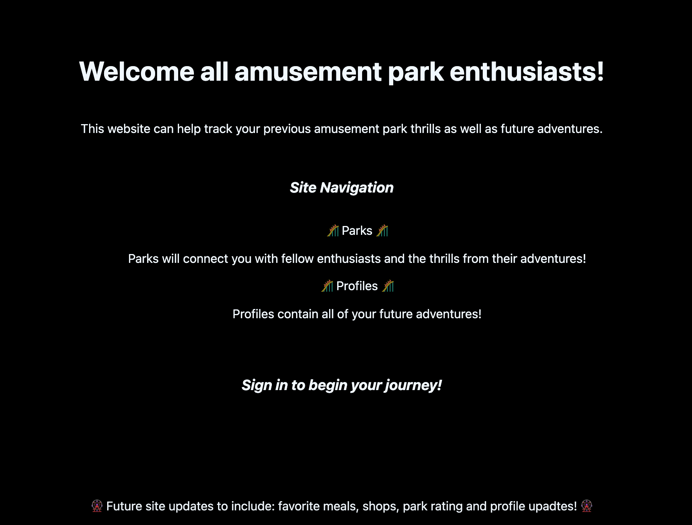

## Thriller-Tracker

Thriller-Tracker is a platform for amusement park enthusiasts. Users can share highlights of their adventures as well as create a bucket list of future adventures to go on.
 
 
# [Share your adventure here!!](https://flyio-thriller-tracker.fly.dev/)
# [Project Planning Materials](https://trello.com/b/ZtHOMmXh/unit-2-project-planning-materials)

## Technologies Used

CSS3, HTML5, JavaScript, GitHub, Git, Node.js, Express.js, MongoDB, Google Cloud, Trello

## Credits

*  Custom favicon designed on [faviconer](http://www.faviconer.com/)
*  OAuth provided by [Google Cloud](https://cloud.google.com/)

## Ice Box Features
* Add adventures to profiles
* Comment functionality on adventures
* Park ratings for adventures.
* Top 5 adventure list on profiles

